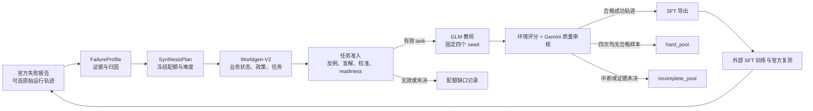
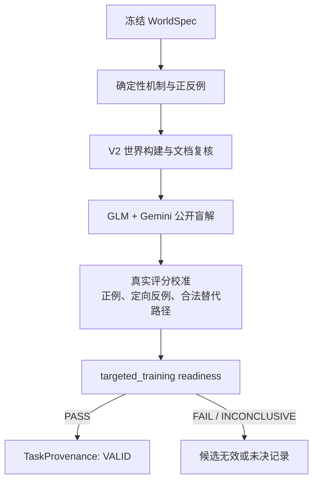
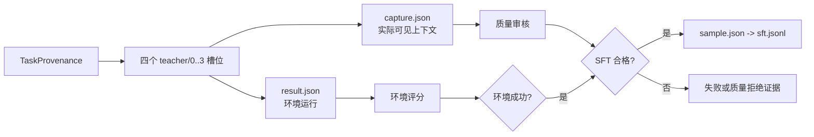

# 失败报告驱动的定向合成 Pipeline 架构

本文解释 `tau3 synthesize targeted` 如何把一次 τ3-banking 官方测评的失败反馈，
转换为可追溯的虚构银行任务、教师成功轨迹和 SFT 数据。它描述系统结构和数据
边界；命令、参数和操作说明见 [targeted-task-synthesis.md](targeted-task-synthesis.md)。

## 一句话概览

这个 pipeline 不是从官方任务直接改写训练题，而是在 `banking_synth` 虚构世界中
重建失败机制。每轮先从失败报告提取有证据的能力缺口，冻结任务配额，再编译新的
业务状态、政策和目标。只有通过独立验证的任务才进入固定四次教师采样；每条成功
轨迹还要通过质量审核，最后才进入 SFT。



外部训练和官方复测不属于本 pipeline；它们产生下一轮的输入，而不是在本轮内部
作为通过条件。

## 两条相互绑定的数据流

### 1. 任务与世界证据流

`planning.py` 把报告和可选运行目录转换为 `FailureProfile`。报告中没有提供的
统计保持未知；LLM 不会补造数字。若有原始轨迹，程序先抽取工具调用、参数差异、
对象覆盖、重复检索和终止原因，再让 GLM 为每个结论引用稳定证据 ID。评分疑点、
任务矛盾和不可靠的文本比较被放入 quarantine，不能直接成为训练目标。

`make_plan()` 只调度已注册的七个 recipe。任务槽位写入 `SynthesisPlan` 后即冻结：

| 配额来源 | 默认比例 | 含义 |
|---|---:|---|
| current | 70% | 本轮失败画像加权后的能力缺口 |
| replay | 20% | 上轮弱项；首轮为基础能力配方 |
| explore | 10% | 两个已验证机制的组合探索 |

同一官方任务命中多个根因时，其贡献在命中的 recipe 之间分摊。教师成功率、采样
失败或导出产量都不能反向降低困难能力的配额。

`recipes.py` 不只改写用户表达，而是先编译客户、账户、卡、业务记录、日期、政策
参数、公开文档、工具契约和目标状态。GLM 只负责受约束地改写公开请求，Gemini 检查
表达等价性。业务指纹由业务事实产生，防止仅改 ID 或文案的重复任务混入覆盖统计。

随后，`workflow.qualify()` 对每个候选执行以下准入门：



定向世界的查询是受客户和产品范围限制、字段投影和分页支持的只读操作。教师只能
使用 `bm25_grep` 公开检索配置，不能拿到 gold、私有目标或一次读取全部记录的捷径。

### 2. 教师轨迹与训练数据流

对每个 `VALID` task，`workflow.collect_slot()` 使用同一 GLM 教师、四个预先确定
seed 采样。用户模拟器和质量审核用 Gemini。教师只能看到正常 agent 上下文，不能
看到失败标签、参考动作、评分意见或之前 seed 的结果。

每条采样产生两种独立结论：

- 环境成功：正常终止，并通过所有必要奖励分量。
- SFT 合格：环境成功，同时最终答复、用户交接、工具格式和信息边界通过质量审核。

因此“环境成功”不会自动成为训练样本。每条合格样本由 `result.json`、
`capture.json`、`quality.json` 和原始审核响应交叉绑定；`world_sft.py` 只导出实际
agent 可见的系统消息、用户消息、工具调用和工具结果。默认 SFT 监督 assistant
消息，用户私有工具、评分意见、gold 和审核上下文不进入训练数据。



四个槽位全都完成但没有任何合格样本的有效任务进入 `hard_pool.json`。超时、基础
设施错误、截断和审核未决属于 `incomplete_pool.json`，不会被伪装成普通教师失败。

## 七个能力 recipe

| recipe | 失败标签 | 编译出的主要行为 |
|---|---|---|
| `discovery` | F1、F3 | 多账户、多卡、多记录枚举；漏掉一个目标对象即失败 |
| `policy` | F2 | 日期边界、金额计算、收益叠加和非默认选项 |
| `handoff` | F3b | 用户实际执行的工具授予、ID、参数与数量一致性 |
| `restraint` | F4、长程执行 | 已处理记录、用户重复提醒和 exactly-once 写入 |
| `escalation` | F5、F6、检索循环 | 可自助与必须升级的对照，按业务原因选择路由 |
| `signature` | F7 | 解锁后遵循实际签名，拒绝额外参数 |
| `boundary` | F8 | 信息充分时完成，不足时询问、待补充或按政策升级 |

任务难度按编译后的参考动作数分桶：`1–4 / 5–9 / 10–14 / 15–19 / 20–29`，默认
比例为 `15 / 25 / 25 / 20 / 15`。业务写入次数单独记录，不能通过重复解锁或重复
查询虚增长度。

## 运行时角色、并发和预算

| 角色 | 模型 | 作用 |
|---|---|---|
| 分析、规划、请求改写、教师 | GLM-5.3-Flash | 归因、策略和正式 agent 轨迹 |
| 用户模拟、质量审核 | Gemini-3.5-Flash | 用户行为和独立 SFT 质量门 |
| 盲解、校准 | GLM + Gemini | 双模型独立验证，不参与教师监督 |

所有物理 LLM 请求共享轮次目录中的 `llm_pool/` 限流池。并发上限属于实验身份；
当前运行版本可使用 256 个 GLM 与 Gemini 合计请求槽位。请求预算单独累计生成、
审核、在线轨迹、物理调用和 token，所有显式重试也计入。教师轨迹的固定四次采样
不会用换 seed 来掩盖一次失败。

世界生成使用独立进程，因为 V2 世界配置包含进程级状态。连续运行时，主调度只负责任务
生成和采样；增量导出在独立子进程完成，避免共享文件系统上的全量证据扫描阻塞调度。

## 导出与恢复

正式导出由 `incremental_export.py` 处理：每个 task 的已验证行保存在
`formal/export-shards/`，输入证据的内容哈希和文件集合未变时才复用分片。随后按
`task_id + trial + seed` 合并，并以原子 JSONL/manifest 事务发布。若 JSONL 已替换
而 manifest 尚未落盘，`export.pending.json` 允许下一次导出恢复，而不会重复或丢失
样本。全部槽位结束后仍需要一次不使用缓存的完整审计。

面向通用 agent 训练的导出可使用
`scripts/export_general_agent_sft.py`。它将可见轨迹变换为 `{tools, messages}`：
每条 assistant 消息带 `loss: true`，其他消息为 `false`，并默认保留真实 provider
响应中存在的 `reasoning_content`。公开 wrapper 工具拥有完整顶层 OpenAI schema；
动态业务工具遵循解锁后返回契约的协议，因此其 schema 作为可见工具结果出现，
不会被伪造成顶层静态工具。

## 一轮产物如何对应模块

下面以 `data/synthetic/targeted-v1-round-000-independent-formal-budget/` 为例：

```text
round-dir/
├── profile.json, report-source.json      # 失败输入与可审计归因
├── plan.json                             # 冻结后的 70/20/10 槽位
├── config.json, settings.json, identity.json
├── budget.json, physical_calls/, requests/  # 物理调用与预算证据
├── llm_pool/                             # 共享请求并发状态
├── pilot/                                # 20-task 试跑及其 80 个槽位
├── formal/
│   ├── slots/000000/...                  # task、world、audit、teacher/0..3
│   ├── sft.jsonl                         # 默认 assistant-only SFT
│   ├── general_agent_reasoning.jsonl     # 通用 agent 格式，保留可用 reasoning
│   ├── export-shards/                    # 可恢复的增量导出分片
│   ├── report.json                       # 固定分母的进度与能力分布
│   ├── hard_pool.json, incomplete_pool.json
│   └── export.json, export.pending.json  # 导出绑定与恢复记录
└── operational-revisions/                # 运行中独立导出器/并发修订的证据
```

`TaskProvenance` 是关键连接点：它把 task 绑定到唯一世界、世界哈希、计划哈希、业务
指纹、槽位、难度和验证结果。任何 task 名称相同但世界初始状态不同的错误加载，都会
在导出或恢复校验中被拒绝。

## 设计边界

- 官方失败反馈影响课程设计，因此官方测评是自适应开发反馈，不是独立 holdout。
- 本 pipeline 测量教师是否能解出合成任务，不能证明训练后官方表现提升；提升必须由
  外部 SFT 后的官方复测确认。
- 合法替代查询或写入顺序可以通过；验证的是可达信息、目标状态、副作用和业务义务，
  不是机械复现参考动作。
- 无效候选可以在同一冻结配额中重建，未决证据和教师失败不能偷偷改成简单题或替换
  固定教师 seed。

## 代码导航

| 模块 | 主要职责 |
|---|---|
| `src/tau3/synthesis/targeted/planning.py` | 报告解析、证据归因、配额冻结 |
| `src/tau3/synthesis/targeted/recipes.py` | 将槽位编译为业务状态、政策和反例 |
| `src/tau3/synthesis/targeted/workflow.py` | 准入、四次采样、SFT 绑定与报告 |
| `src/tau3/worldgen/v2/` | 世界构建、盲解、校准、readiness 与证书 |
| `src/tau3/synthesis/targeted/budget.py` | 物理请求和 token 预算边界 |
| `src/tau3/synthesis/targeted/incremental_export.py` | 分片、校验、原子恢复与导出 |
| `src/tau3/synthesis/world_sft.py` | 实际可见 agent 上下文捕获 |
| `scripts/run_targeted_continuous.py` | 连续调度、独立导出与心跳 |
